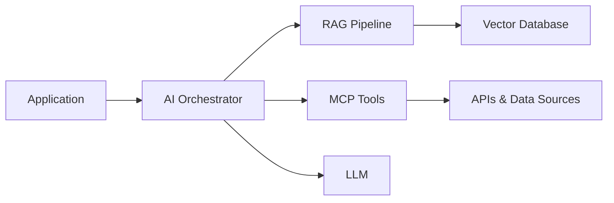

<div align="center">

# Amit Kumar Singh

### Backend & Full-Stack Engineer | Distributed Systems | Generative AI

I design and build scalable backend systems, event-driven workflows, and AI-powered applications across **HRTech, FinTech, and EdTech**.

**3+ years of experience · 150K+ DAU systems · Python · Node.js · React · Kafka · AWS**

<br />

[](https://amittech.in)
[](https://www.linkedin.com/in/amitkumrsingh/)
[](mailto:aksingh1109@gmail.com)

<br />


</div>

---

## 👋 About Me

I’m a software engineer who enjoys turning complex business requirements into reliable and maintainable products.

My experience spans high-scale HRMS platforms, secure banking integrations, EdTech CRMs, distributed event processing, cloud deployments, and Generative AI applications.

```python
amit = {
    "role": "Backend & Full-Stack Engineer",
    "experience": "3+ years",
    "specialization": [
        "Scalable Backend Systems",
        "Distributed Systems",
        "API & Database Design",
        "Generative AI"
    ],
    "core_stack": [
        "Python",
        "Node.js",
        "React",
        "Kafka",
        "Redis",
        "MySQL",
        "AWS"
    ],
    "currently_building": [
        "RAG Applications",
        "AI Agents",
        "MCP Integrations"
    ]
}
```

---

## 🚀 Impact at a Glance

<table>
<tr>
<td align="center" width="25%">
<h3>150K+</h3>
<p>Daily active users supported</p>
</td>
<td align="center" width="25%">
<h3>380+ RPS</h3>
<p>Production traffic bursts handled</p>
</td>
<td align="center" width="25%">
<h3>~60%</h3>
<p>Reduction in onboarding time</p>
</td>
<td align="center" width="25%">
<h3>~30%</h3>
<p>Less investigation effort</p>
</td>
</tr>
</table>

- Built and maintained backend services for a large-scale employee HRMS platform
- Delivered secure banking APIs for **HDFC Forex Card** and **VISA Pay**
- Designed Kafka workflows with idempotency, retry, backoff, and DLQ handling
- Improved platform security through VAPT remediation and PII protection
- Improved a 100+ page EdTech platform’s PageSpeed score from approximately **30 to 98**
- Reduced deployment time by approximately **80%** through CI/CD automation

---

## 🧰 Technology Stack

<div align="center">

### Languages


### Backend & Frontend


### Data, Messaging & Cloud


### Generative AI


</div>

---

## 💼 Professional Experience

### 🚚 Delhivery — Software Developer

**HRMS Platform · Oct 2025 – Jul 2026**

- Developed Python backend services for an HRMS platform serving **150K+ daily active users**
- Built services using **Sanic, Flask, SQLAlchemy, MySQL, Redis, Kafka, and AWS**
- Worked on attendance pipelines processing events from biometric, mobile, and web applications
- Implemented idempotent Kafka consumers with retry, exponential backoff, and DLQ handling
- Automated Aadhaar, PAN, driving licence, and criminal-verification workflows
- Reduced employee onboarding time by approximately **60%**
- Built attendance-error analytics that reduced investigation effort by approximately **30%**
- Reduced team-leader onboarding effort by approximately **20–50%**
- Improved security through VAPT remediation, PII protection, audit fields, and token hardening
- Strengthened reliability using Redis rate limiting, autoscaling, observability, and zero-downtime Kafka migration

**Stack:** Python · Sanic · Flask · Kafka · Redis · MySQL · SQLAlchemy · AWS · Docker · Kubernetes

---

### 💳 FinxBridge — SDE-1

**M2P Fintech · Jan 2025 – Oct 2025**

- Engineered secure API workflows for the **HDFC Forex Card** platform
- Built new-to-bank and existing-to-bank customer journeys
- Delivered four **VISA Pay APIs** to production for SOFI
- Supported multiple international banking integrations through UAT
- Developed REST and SOAP integrations using **Node.js, Express, and MongoDB**
- Implemented JWT authentication, encryption, validation, and secure payload handling
- Improved external-service reliability through structured error and timeout handling
- Managed releases and production deployments using **ArgoCD**

**Stack:** Node.js · Express · MongoDB · REST · SOAP · JWT · ArgoCD

---

### 🎓 Anirvana — Software Developer

**EdTech Products · Jul 2023 – Dec 2024**

- Built CRM modules for lead management, forms, appointments, analytics, billing, and exports
- Developed full-stack features using **React, Redux, Django REST, and PostgreSQL**
- Created configurable forms and dashboards for education-business workflows
- Developed and optimized a 100+ page education platform
- Improved PageSpeed performance from approximately **30 to 98**
- Deployed applications using **AWS EC2, RDS, S3, Nginx, and Gunicorn**
- Reduced deployment time by approximately **80%** using CI/CD automation

**Stack:** React · Redux · Django · PostgreSQL · AWS · Nginx · Docker

---

## 🤖 What I’m Building with Generative AI

I’m exploring how LLMs can solve practical engineering and business problems—not just generate text.



My current areas of focus include:

- Building RAG pipelines with document chunking, embeddings, and vector search
- Developing MCP tools for controlled access to APIs and application data
- Creating agentic workflows that can plan and execute multi-step tasks
- Streaming LLM responses using Server-Sent Events
- Integrating models through AWS Bedrock, Gemini, and other LLM platforms
- Protecting AI systems against prompt injection and unsafe tool execution

---

## 🌟 Featured Projects

<table>
<tr>
<td width="50%" valign="top">

### 🤖 AI-First EdTech CRM

A next-generation CRM concept designed to automate and improve the complete student journey.

**Key capabilities**

- AI-assisted lead prioritization
- Smart follow-up recommendations
- Dynamic forms and workflows
- Student and counselor analytics
- Conversational CRM interactions
- Drag-and-drop dashboards

**Focus:** React · Python · RAG · AI Agents · Analytics

[](https://amittech.in)

</td>
<td width="50%" valign="top">

### 🚗 Distracted Driver Detection

A computer-vision application that detects distracted-driving behaviour.

**Key capabilities**

- Trained using a **22K+ image dataset**
- CNN-based image classification
- OpenCV video-frame processing
- Real-time inference workflow
- Published as a research paper

**Focus:** Python · CNN · OpenCV · Computer Vision

[](https://github.com/Amitkumrsingh/Distracted_Driver_Detection_Using_CNN)
[](https://www.isroset.org/pdf_paper_view.php?paper_id=3044&1-ISROSET-IJSRCSE-08507.pdf)

</td>
</tr>

<tr>
<td width="50%" valign="top">

### 📘 English Learning Application

A responsive MERN application for managing English-learning content.

**Key capabilities**

- Authentication and authorization
- Learning-content management
- Complete CRUD operations
- Responsive user interface
- REST API integration

**Focus:** React · Node.js · Express · MongoDB

[](https://github.com/Amitkumrsingh/LEAG)

</td>
<td width="50%" valign="top">

### 🔎 SEO Ranking Engine

A research-driven webpage-ranking system that provides SEO suggestions.

**Key capabilities**

- Webpage analysis
- Ranking-factor evaluation
- SEO recommendations
- Search-engine concepts
- Research publication

**Focus:** Search · Ranking · SEO · Web Engineering

[](https://ijsrem.com/download/a-webpage-ranking-search-engine-with-seo-suggesters/)

</td>
</tr>
</table>

---

## 🧠 How I Approach Engineering

```text
Understand the problem
        ↓
Design clear contracts
        ↓
Build for correctness
        ↓
Handle failure scenarios
        ↓
Add security and observability
        ↓
Measure, learn, and optimize
```

My engineering principles:

- Keep API contracts predictable and backward-compatible
- Design event consumers to be idempotent
- Plan retries, backoff, and DLQs before production failures happen
- Optimize database queries using execution plans and real metrics
- Protect sensitive data through encryption and least-privilege access
- Use logs, metrics, and traces to make production systems observable
- Choose simple solutions that remain easy to maintain and scale

---

## 🏅 Publications

### Distracted Driver Detection Using CNN

Deep-learning research focused on identifying distracted-driver behaviour using image classification and computer vision.

[Read publication](https://www.isroset.org/pdf_paper_view.php?paper_id=3044&1-ISROSET-IJSRCSE-08507.pdf)

### Webpage Ranking Search Engine with SEO Suggesters

Research focused on webpage ranking factors and automated SEO recommendations.

[Read publication](https://ijsrem.com/download/a-webpage-ranking-search-engine-with-seo-suggesters/)

---


## 📊 GitHub Activity

<div align="center">

<a href="https://github.com/Amitkumrsingh">
  
</a>

<br />

<a href="https://github.com/Amitkumrsingh?tab=repositories">
  
</a>

</div>

---

## 🤝 Let’s Build Something Impactful

I’m open to opportunities and collaborations involving:

- Backend and full-stack engineering
- Python and Node.js applications
- High-scale distributed systems
- Event-driven architectures
- Generative AI, RAG, and AI agents
- Cloud-native product development

<div align="center">

[](https://amittech.in)
[](https://www.linkedin.com/in/amitkumrsingh/)
[](mailto:aksingh1109@gmail.com)

<br />
<br />

### Building systems that are simple to use, difficult to break, and easy to evolve.

</div>
